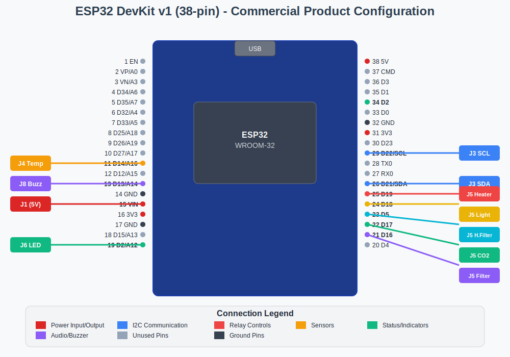
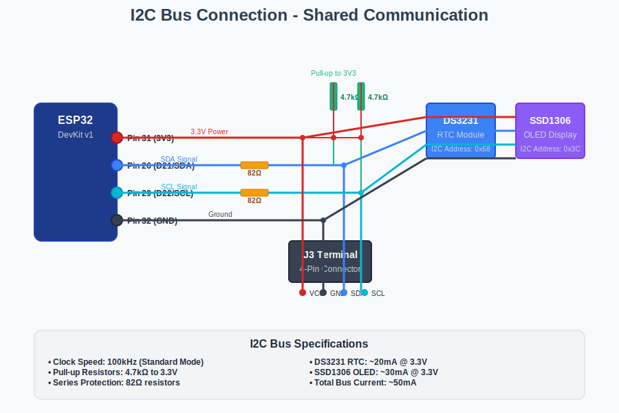
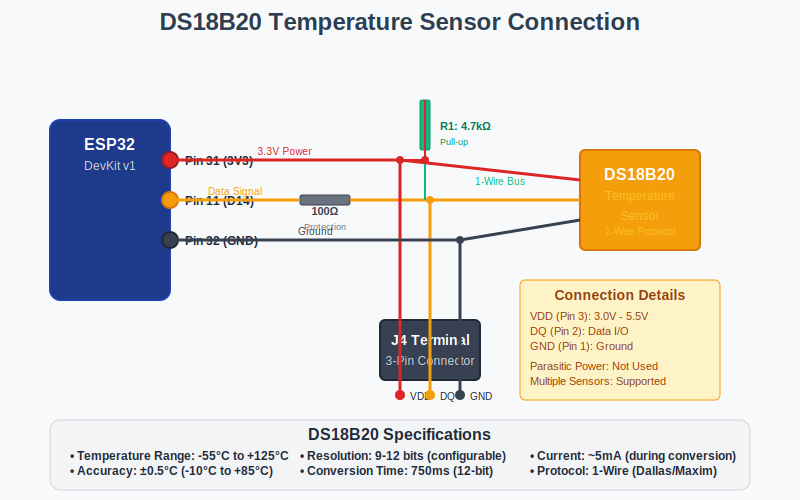
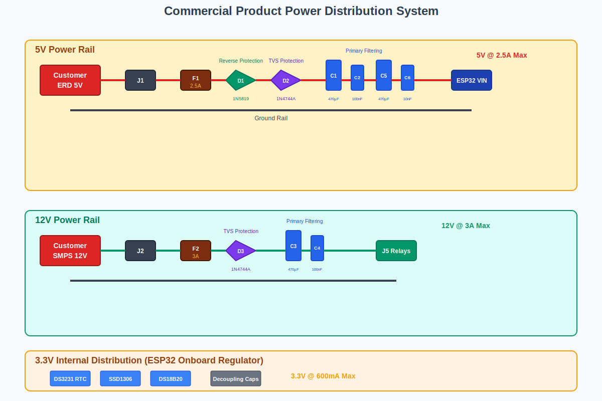
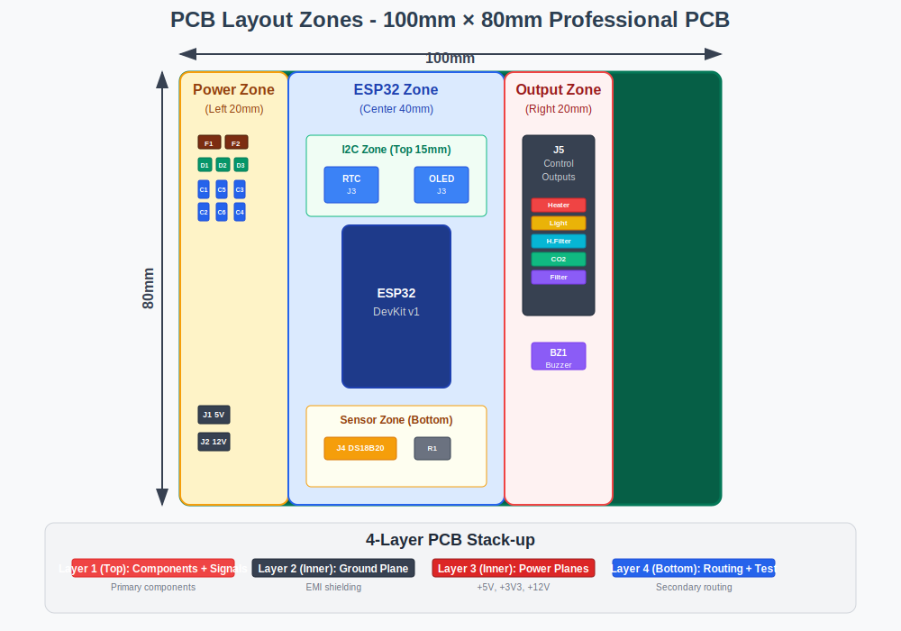

# ESP32 Fish Tank Automation Commercial Product - Professional Connection Diagram

## Commercial Installation Reference Guide

This document provides professional connection diagrams for the ESP32 Fish Tank Automation Commercial Product. These diagrams are designed for qualified electrician installation and customer setup with external power supplies.

---

## 🔌 **ESP32 DevKit v1 (38-pin) - Commercial Product Configuration**



### **Professional PCB Pin Assignments**

| Pin# | ESP32 Pin | Function | Connection | Terminal | Purpose |
|------|-----------|----------|------------|----------|---------|
| **11** | D14/A16 | GPIO Output | DS18B20 Data | J4 | Temperature sensor |
| **13** | D13/A14 | GPIO Output | Buzzer Control | J8 | Alert buzzer |
| **15** | VIN | Power Input | 5V Customer ERD | J1 | Main power input |
| **21** | D16 | GPIO Output | Filter Relay | J5-1 | Main filter control |
| **22** | D17 | GPIO Output | CO2 Relay | J5-2 | CO2 system control |
| **23** | D5 | GPIO Output | HangOn Filter | J5-3 | Backup filter control |
| **24** | D18 | GPIO Output | Light Relay | J5-4 | Lighting control |
| **25** | D19 | GPIO Output | Heater Relay | J5-5 | Temperature control |
| **26** | D21/SDA | I2C Data | RTC + OLED SDA | J3-2 | I2C communication |
| **29** | D22/SCL | I2C Clock | RTC + OLED SCL | J3-3 | I2C communication |

### **Power Distribution from ESP32**

| ESP32 Pin | Voltage | Max Current | Connected To | Notes |
|-----------|---------|-------------|--------------|-------|
| **Pin 31 (3V3)** | 3.3V | 600mA | DS3231, SSD1306, DS18B20 | Internal regulator output |
| **Pin 15 (VIN)** | 5V | 2.5A | Customer ERD Input | External 5V input |
| **Pins 14,17,32** | GND | - | Common ground | Multiple ground connections |

---

## 🔗 **I2C Bus Connection (Shared)**



### **I2C Bus Component Specifications**

| Component | I2C Address | Voltage | Current | Terminal |
|-----------|-------------|---------|---------|----------|
| **DS3231 RTC** | 0x68 | 3.3V | ~20mA | J3 (4-pin) |
| **SSD1306 OLED** | 0x3C | 3.3V | ~30mA | J3 (4-pin) |
| **Pull-up Resistors** | - | 3.3V | 4.7kΩ each | On-board |
| **Series Resistors** | - | - | 82Ω each | Signal protection |

---

## 🌡️ **DS18B20 Temperature Sensor Connection**



### **DS18B20 Component Specifications**

| Parameter | Value | Notes |
|-----------|-------|-------|
| **Supply Voltage** | 3.0V - 5.5V | Powered from ESP32 3V3 |
| **Operating Current** | ~5mA | During temperature conversion |
| **Temperature Range** | -55°C to +125°C | Suitable for aquarium use |
| **Accuracy** | ±0.5°C | From -10°C to +85°C |
| **Resolution** | 9-12 bits | Configurable precision |
| **Pull-up Resistor** | 4.7kΩ | Required for 1-Wire protocol |
| **Series Resistor** | 100Ω | GPIO protection |
| **Terminal** | J4 (3-pin) | Screw terminal connection |
                                        │
                                        │
3V3 ─────── 4.7kΩ pull-up ──────────────┘

3V3 ────────────────────────────────── DS18B20 VDD

GND ────────────────────────────────── DS18B20 GND
```

**Waterproof DS18B20 Cable Colors:**
- **Red Wire**: VDD (3V3)
- **Black Wire**: GND  
- **Yellow Wire**: DQ (Data to GPIO 14)

---

## 🔊 **Buzzer Connection**

```
ESP32 Pin 13 (D13) ───── 100Ω ───── Buzzer Positive (+)
                                        │
                                        │
GND ────────────────────────────────── Buzzer Negative (-)
```

**Customer Buzzer Specifications:**
- **Type**: Active Buzzer (recommended) or Passive Buzzer
- **Voltage**: 3V-5V compatible
- **Current**: <30mA
- **Frequency**: 2kHz-4kHz (passive buzzer)
- **Connection**: Via J8 PCB screw terminal

**Programming Notes:**
- ESP32 Core 3.0+: `tone()` function is used
- ESP32 Core 2.x: LEDC PWM is used

---

## ⚡ **8-Channel Relay Module Connection**

```
Relay Module Control Inputs:
ESP32 Pin 21 (D16) ───── 330Ω ───── IN1 (Filter)
ESP32 Pin 22 (D17) ───── 330Ω ───── IN2 (CO2)
ESP32 Pin 24 (D18) ───── 330Ω ───── IN3 (Light)
ESP32 Pin 25 (D19) ───── 330Ω ───── IN4 (Heater)
ESP32 Pin 23 (D5)  ───── 330Ω ───── IN5 (HangOn Filter)
                                    IN6 (Not Used)
                                    IN7 (Not Used)
                                    IN8 (Not Used)

Relay Module Power:
ESP32 VIN (5V) ──────────────────── Relay VCC
GND ────────────────────────────── Relay GND

External 12V Supply ───────────────── Relay JD-VCC
External 12V GND ──────────────────── Relay GND (Isolated)

Relay Outputs (Each relay has):
- COM (Common)
- NO (Normally Open)  
- NC (Normally Closed)

Note: Remove VCC-JD-VCC jumper for opto-isolation
```

---

## 🔋 **Commercial Product Power Distribution System**



### **Power Input Specifications**

| Input Type | Voltage | Current | Fuse | Protection | Terminal |
|------------|---------|---------|------|------------|----------|
| **Customer ERD Charger** | 5V DC | 2.5A Max | F1 (2.5A) | NTC1 + D1 + D2 + C1,C5 | J1 |
| **Customer SMPS** | 12V DC | 3A Max | F2 (3A) | D3 + C3 | J2 |

### **5V Rail Power Flow Diagram**

```
Customer ERD 5V ──► J1 Terminal ──► [NTC1: 5D-11] ──► [F1: 2.5A] ──► [D1: 1N5819] ──► [D2: 1N4744A] ──┬── ESP32 VIN
                                 Inrush Limiter        Fuse         Reverse          TVS              │
                                      Fuse         Reverse          TVS              │
Customer GND    ────────────────────────────────────────────────────────────────────┼── ESP32 GND
                                                                                     │
                                                                                     ├── Filter Caps:
                                                                                     │   C1: 470µF/25V
                                                                                     │   C5: 470µF/25V
```

### **12V Rail Power Flow Diagram**

```
Customer 12V ──► J2 Terminal ──► [NTC2: 5D-11] ──► [F2: 3A] ──► [D3: 1N4744A] ──┬── J5 Relay JD-VCC
                                 Inrush Limiter    Fuse        TVS               │
Customer GND ────────────────────────────────────────────────────────────────────┼── J5 Relay GND
                                                                               │
                                                                               ├── Filter Caps:
                                                                               │   C3: 470µF/25V
```

### **3.3V Internal Distribution**

| Output | Load | Current | Notes |
|--------|------|---------|-------|
| **DS3231 VCC** | RTC Module | ~20mA | From ESP32 3V3 pin |
| **SSD1306 VCC** | OLED Display | ~30mA | From ESP32 3V3 pin |
| **DS18B20 VDD** | Temperature Sensor | ~5mA | From ESP32 3V3 pin |
| **Decoupling** | C7-C12 (100nF each) | - | Near each module |

---

## 🛡️ **Protection Circuit Details**

### **5V Rail Protection Components**

| Component | Type | Rating | Function |
|-----------|------|--------|----------|
| **F1** | Fuse | 2.5A Fast-Blow | Overcurrent protection |
| **D1** | Schottky Diode | 1N5819 (40V, 1A) | Reverse polarity protection |
| **D2** | TVS Diode | 1N4744A (15V) | Transient voltage suppression |
| **C1, C5** | Electrolytic | 470µF/25V | Primary ripple filtering |

### **12V Rail Protection Components**

| Component | Type | Rating | Function |
|-----------|------|--------|----------|
| **NTC2** | Inrush Limiter | 5D-11 (10Ω) | Limits inrush current |
| **F2** | Fuse | 3A Fast-Blow | Overcurrent protection |
| **D3** | TVS Diode | 1N4744A (15V) | Transient voltage suppression |
| **C3** | Electrolytic | 470µF/25V | Primary ripple filtering |

### **GPIO Protection Scheme**

```
ESP32 GPIO Output ───[330Ω]─── Relay Control Input
ESP32 GPIO Input  ───[100Ω]─── Sensor Signal Input
```

| Protection Type | Resistor Value | Purpose |
|----------------|----------------|---------|
| **Relay Drive** | 330Ω | Current limiting for relay drivers |
| **Sensor Input** | 100Ω | Input protection from sensor signals |

### **EMI Suppression Components**

| Component | Type | Rating | Function |
|-----------|------|--------|----------|
| **FB1** | Ferrite Bead | 120Ω@100MHz/1A (0603 SMD) | Power line EMI filtering |
| **FB2** | Ferrite Bead | 120Ω@100MHz/1A (0603 SMD) | Signal line EMI filtering |

**Note**: Ferrite beads provide EMI suppression at high frequencies while maintaining low DC resistance for power and signal integrity.

---

## 🛡️ **Protection Circuit Details**

```
5V Rail Protection:
5V+ ───[F1]───[D1]───[D2]───[C1]───[C5]─── Clean 5V to ESP32
       2.5A   1N5819  1N4744A  470µF   470µF
       Fuse   Schottky 15V     Filter   Filter

12V Rail Protection:  
12V+ ───[NTC2]───[F2]───[D3]───[C3]─── Clean 12V to Relays
        5D-11    3A     1N4744A  470µF
        Inrush   Fuse   15V      Filter
        Limiter

GPIO Protection (Each control line):
ESP32 GPIO ───[330Ω]─── Relay Input
ESP32 GPIO ───[100Ω]─── Sensor Input
```

I2C Protection:
ESP32 SDA ───[82Ω]───[4.7kΩ to 3V3]─── I2C SDA Bus
ESP32 SCL ───[82Ω]───[4.7kΩ to 3V3]─── I2C SCL Bus
```

---

## 🔌 **Connector Specifications**

### J1: 5V Power Input (Phoenix Contact)

| **Pin** | **Signal** | **Wire Color** |
|---------|------------|----------------|
| 1 | +5V Input | Red Wire |
| 2 | GND | Black Wire |

### J2: 12V Relay Power (Phoenix Contact)

| **Pin** | **Signal** | **Wire Color** |
|---------|------------|----------------|
| 1 | +12V Input | Red Wire |
| 2 | GND | Black Wire |

### J3: I2C Modules (JST XH 4-pin)

| **Pin** | **Signal** | **Wire Color** |
|---------|------------|----------------|
| 1 | 3V3 | Red Wire |
| 2 | GND | Black Wire |
| 3 | SDA | Blue Wire |
| 4 | SCL | Yellow Wire |

### J4: DS18B20 Temperature (JST XH 3-pin)

| **Pin** | **Signal** | **Wire Color** |
|---------|------------|----------------|
| 1 | 3V3 | Red Wire |
| 2 | GND | Black Wire |
| 3 | DQ Data | Yellow Wire |

### J5: Control Outputs (JST XH 8-pin)

| **Pin** | **Signal** | **GPIO** |
|---------|------------|----------|
| 1 | Filter Control | GPIO 16 |
| 2 | CO2 Control | GPIO 17 |
| 3 | Light Control | GPIO 18 |
| 4 | Heater Control | GPIO 19 |
| 5 | HangOn Control | GPIO 5 |
| 6 | Buzzer Output | GPIO 13 |
| 7 | GND Reference | - |

---

## 📏 **PCB Layout Zones**



### **100mm × 80mm Professional PCB Layout**

| Zone | Dimensions | Components | Purpose |
|------|------------|------------|---------|
| **Power Zone** | Left 20mm | F1, F2, D1, D2, D3, C1, C3, C5, J1, J2 | Input protection & filtering |
| **ESP32 Zone** | Center 40mm | ESP32 DevKit v1 socket | Main controller |
| **I2C Zone** | Top 15mm | DS3231 (J3), SSD1306 (J3) | Real-time clock & display |
| **Sensor Zone** | Bottom area | DS18B20 (J4), R1 pull-up | Temperature sensing |
| **Output Zone** | Right 20mm | J5 terminals, BZ1 buzzer | Control outputs |

### **PCB Layout Diagram**

```
┌─────────────────────────────────────────────────────────────┐
│                    100mm x 80mm PCB Layout                 │
├─────────────────────────────────────────────────────────────┤
│  Power Zone          │         ESP32 Zone        │ Output  │
│  (Left 20mm)         │        (Center 40mm)      │ Zone    │
│                      │                           │(Right   │
│  [F1] [F2]          │                           │ 20mm)   │
│  [D1] [D2] [D3]     │        ┌─────────┐       │         │
│  [C1] [C3] [C5]     │        │         │       │ [J5]    │
│                      │        │  ESP32  │       │ Control │
│                      │        │ DevKit  │       │ Outputs │
│                      │        │   v1    │       │         │
│  [J1] 5V Input      │        │         │       │ [BZ1]   │
│  [J2] 12V Input     │        └─────────┘       │ Buzzer  │
│                      │                           │         │
│                      │  I2C Zone (Top 15mm)     │         │
│                      │  ┌──────┐  ┌──────┐     │         │
│                      │  │ RTC  │  │ OLED │     │         │
│                      │  │ J3   │  │ J3   │     │         │
│                      │  └──────┘  └──────┘     │         │
│                      │                           │         │
│                      │  Sensor Zone (Bottom)    │         │
│                      │  [J4] DS18B20            │         │
│                      │  [R1] Pull-up            │         │
└─────────────────────────────────────────────────────────────┘
```

### **4-Layer PCB Stack-up**

| Layer | Type | Function | Notes |
|-------|------|----------|-------|
| **Layer 1 (Top)** | Signal | Components + Signal Routing | Primary component placement |
| **Layer 2 (Inner)** | Ground | Ground Plane (Solid Pour) | EMI shielding & return path |
| **Layer 3 (Inner)** | Power | Power Planes (+5V, +3V3, +12V) | Clean power distribution |
| **Layer 4 (Bottom)** | Signal | Additional Routing + Test Points | Secondary routing & testing |

---

## 🧪 **Test Points for Debugging**

```
TP1: +5V Rail (After protection) ────── [Test Point]
TP2: +3V3 Rail (ESP32 output) ──────── [Test Point]
TP3: +12V Rail (Relay power) ───────── [Test Point]
TP4: GND Reference ──────────────────── [Test Point]
TP5: I2C SDA Signal ─────────────────── [Test Point]
TP6: I2C SCL Signal ─────────────────── [Test Point]
TP7: DS18B20 Data Signal ────────────── [Test Point]
TP8: Buzzer Output ───────────────────── [Test Point]

**Test Point Placement:**
- **Power test points**: On left edge
- **Signal test points**: Near respective circuits
- **Ground test points**: At corners
- **All test points**: Accessible with probe
```

---

## 🔧 **Assembly Sequence**

```
Step 1: Power Components
├── Install fuses F1, F2
├── Install protection diodes D1, D2, D3
├── Install filter capacitors C1, C3, C5
└── Test power rails with multimeter

Step 2: Protection Resistors
├── Install GPIO protection resistors R4-R8
├── Install sensor protection resistors R9-R10
├── Install I2C protection resistors R11-R12
└── Install pull-up resistors R1-R3

Step 3: Connectors
├── Install power input connectors J1, J2
├── Install module connectors J3, J4
├── Install output connector J5
└── Test continuity

Step 4: ESP32 Module
├── Install pin headers for ESP32 socket
├── Insert ESP32 DevKit v1 module
├── Apply power and test 5V → 3V3 conversion
└── Program and test basic GPIO functions

Step 5: Module Connections
├── Connect DS3231 RTC module via J3
├── Connect SSD1306 OLED via J3 (parallel)
├── Connect DS18B20 sensor via J4
└── Test I2C communication and sensor readings

Step 6: Customer Installation & Final Assembly
├── Customer connects relay module via J5 terminal
├── Customer installs buzzer via J8 terminal
├── Customer connects external 12V SMPS to relay JD-VCC via J5
├── Customer connects external 5V ERD charger via J1
├── Professional electrician installs 6A MCB for AC protection
└── Complete system functional test by qualified technician
```

This comprehensive commercial product connection diagram provides all the professional installation references needed for creating your KiCad schematic, PCB layout, and customer installation guide! 🚀


🎨 Created SVG Diagrams:
esp32_pinout_diagram.svg - ESP32 DevKit v1 with color-coded pin connections

🔴 Red: Power connections (5V, 3V3)
🔵 Blue: I2C communication (SDA/SCL)
🟠 Orange: Temperature sensor
🟢 Green: Status indicators
🟣 Purple: Audio/control outputs
🟡 Yellow: Relay controls
power_distribution_diagram.svg - Complete power system with protection

🟡 Yellow background: 5V rail section
🟢 Green background: 12V rail section
🟠 Orange background: 3.3V internal distribution
Color-coded components and protection circuits
pcb_layout_zones_diagram.svg - 100mm×80mm PCB organization

🟡 Yellow: Power zone (left 20mm)
🔵 Blue: ESP32 zone (center 40mm)
🔴 Red: Output zone (right 20mm)
🟢 Green: I2C zone with proper dimensions
4-layer stack-up visualization
i2c_bus_diagram.svg - Shared I2C communication

🔵 Blue: SDA data line
🟢 Cyan: SCL clock line
🔴 Red: Power distribution
🟣 Purple: Component modules
Pull-up resistors and signal protection
ds18b20_connection_diagram.svg - Temperature sensor wiring

🟠 Orange: DS18B20 sensor and data line
🔴 Red: Power connections
⚫ Black: Ground connections
🟢 Green: Pull-up resistor
Technical specifications included
